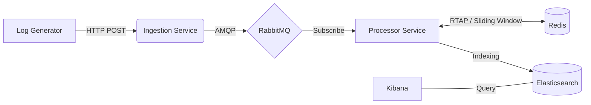

# Mini-SIEM (Security Information and Event Management)

A distributed, microservices-based SIEM system designed to detect security incidents in real-time. The project demonstrates a **Event-Driven Architecture** deployed on **Kubernetes**, utilizing **RabbitMQ** for buffering, **Redis** for stateful analysis, and the **ELK Stack** for visualization.

---

## Architecture & Workflow

The system is designed as a set of decoupled microservices to ensure scalability and fault tolerance.



### Components

* **Log Generator**: Simulates network traffic, including valid requests and occasional **Brute Force attacks**.
* **Ingestion Service**: A high-performance REST API acting as an entry buffer. It accepts logs and immediately pushes them to the queue.
* **RabbitMQ**: Message broker that decouples ingestion from processing, handling traffic bursts.
* **Processor Service**: The core worker service.
    * **RTAP (Real-Time Analytical Processing)**: Uses Redis to track failed logins using a sliding window algorithm. Triggers alerts if thresholds are exceeded.
    * **Archiving**: Indexes all events into Elasticsearch.
* **Visualization**: Kibana dashboards for historical log analysis.

---

## Technologies

* **Core**: .NET 10 (C#)
* **Orchestration**: Docker & Kubernetes
* **Messaging**: RabbitMQ
* **Fast Storage**: Redis (for detection logic)
* **Data & Viz**: Elasticsearch & Kibana

---

## Prerequisites

Before running the project, ensure you have the following installed:

* [Docker Desktop](https://www.docker.com/products/docker-desktop/) (Kubernetes enabled in settings)
* `kubectl` CLI tool
* `git`

---

## How to Run

### 1. Clone the repository

```bash
git clone https://github.com/Matys134/mini-SIEM.git
cd mini-SIEM
```

### 2. Build Docker Images

Since this runs on a local Kubernetes cluster, you need to build the images locally so the cluster can find them. Run these commands from the root directory:

```bash
# Build Ingestion Service
docker build -t siem-ingestion:latest -f IngestionService/Dockerfile .

# Build Processor Service
docker build -t siem-processor:latest -f ProcessorService/Dockerfile .

# Build Log Generator
docker build -t siem-generator:latest -f LogGenerator/Dockerfile .
```

### 3. Deploy Infrastructure

Start the supporting services (Database layer).

```bash
kubectl apply -f k8s/infrastructure.yaml
```

> **Note:** Wait approx. **30-60 seconds** for RabbitMQ, Redis, and Elastic to fully initialize.

### 4. Deploy Microservices

Start the application logic.

```bash
kubectl apply -f k8s/apps.yaml
```

### 5. Verify Deployment

Check if all pods are running:

```bash
kubectl get pods
```

*All pods should show status `Running`.*

---

## Usage & Monitoring

### Web Interfaces

Once running, you can access the following dashboards:

| Service | URL | Credentials |
| :--- | :--- | :--- |
| **Kibana** (Logs & Viz) | http://localhost:5601 | N/A |
| **RabbitMQ Management** | http://localhost:15672 | User: `guest` / Pass: `guest` |

### Watching Real-Time Detection

To see the **RTAP (Real-Time Analytical Processing)** in action, follow the logs of the Processor service. The generator will randomly simulate a Brute Force attack.

```bash
kubectl logs -f deployment/processor-service
```

When an attack occurs, the console will output an alert:

```text
-> [Redis Watch] IP 66.66.66.66 failures: 5/5
************************************************
[RTAP ALERT] BRUTE FORCE DETECTED!
Target IP: 66.66.66.66
Reason: 5 failed logins in < 10 seconds
************************************************
```

---

## Stopping the Project

To stop the application and remove all resources from Kubernetes:

```bash
kubectl delete -f k8s/apps.yaml
kubectl delete -f k8s/infrastructure.yaml
```

---

## Project Structure

* `IngestionService/` - .NET Web API for log ingestion.
* `ProcessorService/` - .NET Console App (Worker) for logic & DB writing.
* `LogGenerator/` - Simulation tool for generating traffic.
* `k8s/` - Kubernetes manifests (Deployment, Services).
