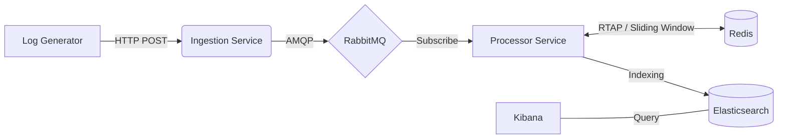

# Mini-SIEM (Security Information and Event Management)

[cite_start]A distributed, microservices-based SIEM system designed to detect security incidents in real-time[cite: 1, 2]. [cite_start]The project demonstrates a robust **Event-Driven Architecture** deployed on **Kubernetes**, utilizing **RabbitMQ** for buffering, **Redis** for stateful analysis, and the **ELK Stack** for visualization[cite: 3].

---

## 🏗 Architecture & Workflow

[cite_start]The system is designed as a set of decoupled microservices to ensure scalability and fault tolerance[cite: 5].


```mermaid
graph LR
    A[Log Generator] -->|HTTP POST| B(Ingestion Service)
    B -->|AMQP| C{RabbitMQ}
    C -->|Subscribe| D[Processor Service]
    D <-->|RTAP / Sliding Window| E[(Redis)]
    D -->|Indexing| F[(Elasticsearch)]
    G[Kibana] ---|Query| F
```

### Components

* [cite_start]**Log Generator**: Simulates network traffic, including valid requests and occasional **Brute Force attacks**[cite: 10].
* [cite_start]**Ingestion Service**: A high-performance REST API acting as an entry buffer[cite: 11]. [cite_start]It accepts logs and immediately pushes them to the queue[cite: 12].
* [cite_start]**RabbitMQ**: Message broker that decouples ingestion from processing, handling traffic bursts[cite: 13].
* [cite_start]**Processor Service**: The core worker service[cite: 14].
    * [cite_start]**RTAP (Real-Time Analytical Processing)**: Uses Redis to track failed logins using a sliding window algorithm[cite: 15]. [cite_start]Triggers alerts if thresholds are exceeded[cite: 16].
    * [cite_start]**Archiving**: Indexes all events into Elasticsearch[cite: 17].
* [cite_start]**Visualization**: Kibana dashboards for historical log analysis[cite: 18].

---

## 🚀 Technologies

* [cite_start]**Core**: .NET 8 (C#) [cite: 20]
* [cite_start]**Orchestration**: Docker & Kubernetes [cite: 21]
* [cite_start]**Messaging**: RabbitMQ [cite: 22]
* [cite_start]**Fast Storage**: Redis (for detection logic) [cite: 23]
* [cite_start]**Data & Viz**: Elasticsearch & Kibana [cite: 24]

---

## 🛠 Prerequisites

[cite_start]Before running the project, ensure you have the following installed[cite: 26]:

* [cite_start][Docker Desktop](https://www.docker.com/products/docker-desktop/) (Kubernetes enabled in settings) [cite: 27]
* [cite_start]`kubectl` CLI tool [cite: 28]
* [cite_start]`git` [cite: 29]

---

## 🏁 How to Run

### 1. Clone the repository

```bash
git clone [https://github.com/Matys134/mini-SIEM.git](https://github.com/Matys134/mini-SIEM.git)
cd mini-SIEM
```

### 2. Build Docker Images

[cite_start]Since this runs on a local Kubernetes cluster, you need to build the images locally so the cluster can find them[cite: 34]. [cite_start]Run these commands from the root directory[cite: 35]:

```bash
# Build Ingestion Service
docker build -t siem-ingestion:latest -f IngestionService/Dockerfile .

# Build Processor Service
docker build -t siem-processor:latest -f ProcessorService/Dockerfile .

# Build Log Generator
docker build -t siem-generator:latest -f LogGenerator/Dockerfile .
```

### 3. Deploy Infrastructure

[cite_start]Start the supporting services (Database layer)[cite: 38].

```bash
kubectl apply -f k8s/infrastructure.yaml
```

> **Note:** Wait approx. [cite_start]**30-60 seconds** for RabbitMQ, Redis, and Elastic to fully initialize[cite: 40].

### 4. Deploy Microservices

[cite_start]Start the application logic[cite: 42].

```bash
kubectl apply -f k8s/apps.yaml
```

### 5. Verify Deployment

[cite_start]Check if all pods are running[cite: 45]:

```bash
kubectl get pods
```

[cite_start]*All pods should show status `Running`[cite: 47].*

---

## 📊 Usage & Monitoring

### Web Interfaces

[cite_start]Once running, you can access the following dashboards[cite: 50]:

| Service | URL | Credentials |
| :--- | :--- | :--- |
| **Kibana** (Logs & Viz) | http://localhost:5601 | [cite_start]N/A [cite: 51] |
| **RabbitMQ Management** | http://localhost:15672 | [cite_start]User: `guest` / Pass: `guest` [cite: 52, 53, 54] |

### 👀 Watching Real-Time Detection

[cite_start]To see the **RTAP (Real-Time Analytical Processing)** in action, follow the logs of the Processor service[cite: 56]. [cite_start]The generator will randomly simulate a Brute Force attack[cite: 57].

```bash
kubectl logs -f deployment/processor-service
```

[cite_start]When an attack occurs, the console will output an alert[cite: 59]:

```text
-> [Redis Watch] IP 66.66.66.66 failures: 5/5
************************************************
[RTAP ALERT] BRUTE FORCE DETECTED!
Target IP: 66.66.66.66
Reason: 5 failed logins in < 10 seconds
************************************************
```

---

## 🛑 Stopping the Project

[cite_start]To stop the application and remove all resources from Kubernetes[cite: 62]:

```bash
kubectl delete -f k8s/apps.yaml
kubectl delete -f k8s/infrastructure.yaml
```

---

## 📂 Project Structure

* [cite_start]`IngestionService/` - .NET Web API for log ingestion[cite: 65].
* [cite_start]`ProcessorService/` - .NET Console App (Worker) for logic & DB writing[cite: 66].
* [cite_start]`LogGenerator/` - Simulation tool for generating traffic[cite: 67].
* [cite_start]`k8s/` - Kubernetes manifests (Deployment, Services)[cite: 68].
